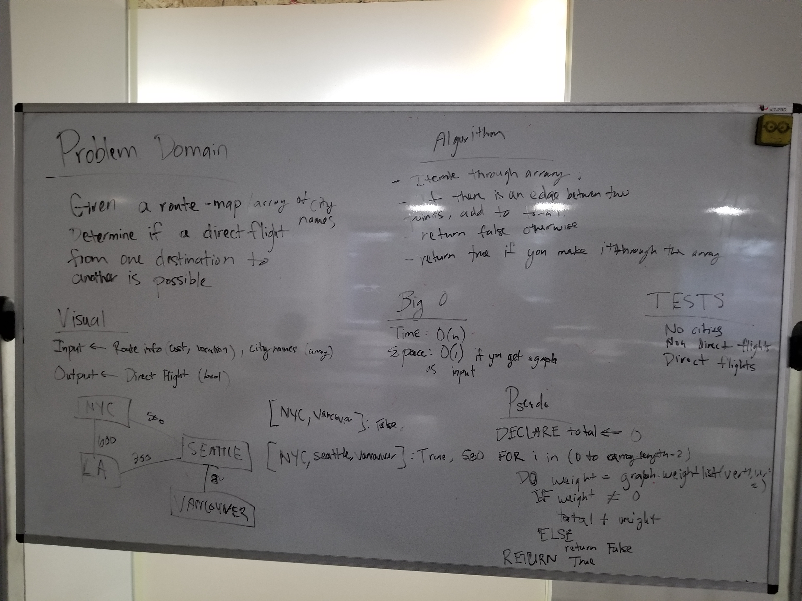

# Direct Flight

## Challenge
Given a graph route map for alaska airlines and an array of cities, determine if a route is possible and return the total amount to get there.

## Approach & Efficiency

Big O time: O(N)
We traverse through the array, so without considering the time for lookups in a dictionary, iterating through the array is the only cost.
Big space: O(1)
Since we did not create any new instances, time is instant.

## Solution
.