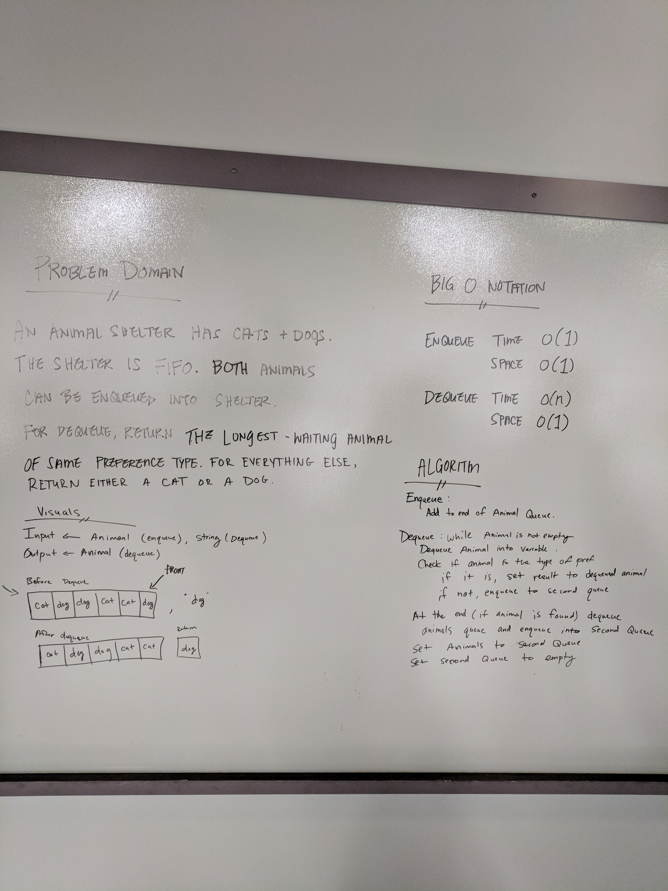

# Multi-Bracket Valication
This validates whether braces are properly balanced

## Challenge
Given a string input determine whether all of the braces are balanced. Do not take into account letters and anything that is not a brace.

## Approach & Efficiency

Big O time: O(n)
Since you are comparing the whole string in the worst case, you have to traverse each character. That means the time is O(n)
Big O space: O(n)
We are creating a stack to push in the braces. This depends on the amount of braces so this becomes O(n)

## Solution
.