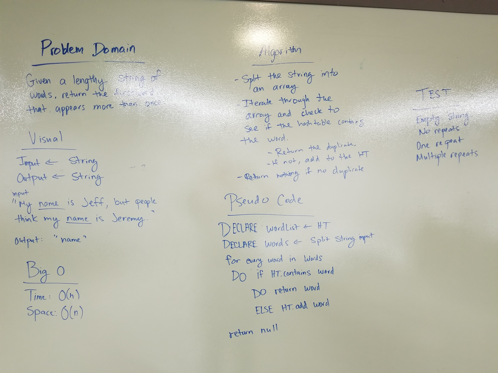

# Repeated Word

## Challenge
Given a string input, return the first repeated word.

## Approach & Efficiency

Big O time: O(N)
We traverse through the whole string depending on size N if there are no repeats.
Big space: O(N)
We are adding a new hashtable with key and values equivalent to the string size, if there are no repeats.

## Solution
.