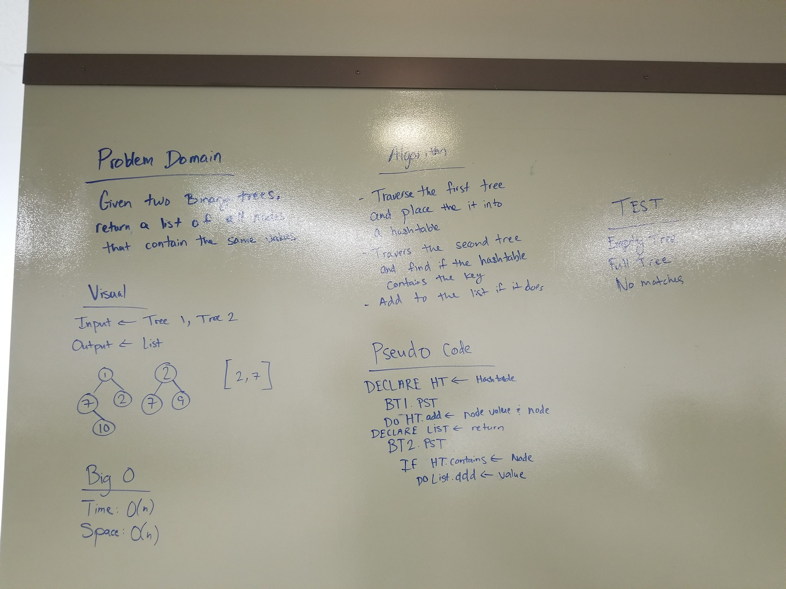

# Tree Intersection
A list of intersects between two binary trees.
## Challenge
Given two binary tree inputs, find and return a list of the intersecting values of the two trees.

## Approach & Efficiency

Big O time: O(N)
We traverse through both the first and second trees fully. That depends on N nodes, so that means time is O(N).
Big space: O(N)
We are adding a new hashtable with key and values equivalent to the first binary tree.

## Solution
.